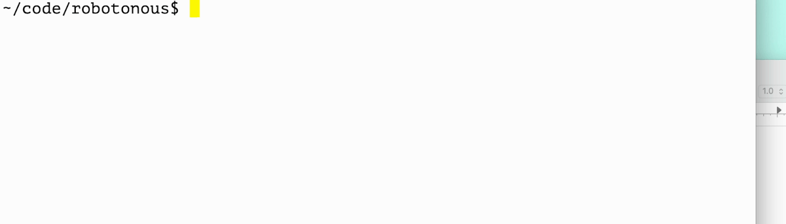

# Robotonous

Monotonous computer activities Roboticized.

Have there been times where you'd like to automate many of your typing
tasks?  Have your actions required coordination across windows — type
a few letters here, click on the other window, wait a few seconds,
type some more?  Robotonous ~~is~~ might be for you.

Since Java 1.3, the Java SDK has had the class
[java.awt.Robot](https://docs.oracle.com/en/java/javase/17/docs/api/java.desktop/java/awt/Robot.html)
that allows mouse control and text entry.  Robot is low level.  For
instance, I'd like to make the computer _type_ something but Robot
doesn't have a `type` API.  Adding those capabilities is Robotonous's
main contribution.

**Note**: Robotonous is in early stages of development and use.  It is
messy and not easy to use.  At the current state its features are
powered more for my usecases (my YouTube channel) than for usability.
That said it has improved with each video produced.

## Building
Java 17 is the minimum required version for Robotonous because it uses
switch expressions.

```shell
javac -d bin `find src -type f -name '*.java'`
```

## Running
Running the program is as shown below.  See
[§Instructions](#instructions) for details.

```shell
java -cp bin com.lvijay.robotonous.Main instructions.robo
```

## Instructions
Robotonous expects typing instructions in ascii text, specifically a
typical 104 key qwerty keyboard layout with unicode keys issuing
special commands.  When Robotonous encounters ordinary keyboard
characters, it will type them the same way a human might.  For
instance, the string `Hello!` will result in typing `SHIFT h` followed
by `e`, `l`, `l`, `o`, and finally `SHIFT 1`.  (On my US-English
qwerty keyboard `!` is typed by pressing `SHIFT` and `1` together.)

See a sample video below.



Typing keyboard keys is straightforward.  The keys as they appear will
be typed.

### Chording

Typing multiple keys at once is known as
[chording](https://www.emacswiki.org/emacs/Chord).  Ever typed the
keyboard shortcuts for Cut/Copy/Paste?  You've key chorded.

To chord in Robotonous you enter a special character, `«` is the
default character (it can be customized, see
[§Customizations](#customizations) below).  A character sequence that
starts with `«` and ends with `«` be typed together.  The default
character for the SHIFT key is `§`, the chord `«§abcdef«` types out
ABCDEF.  Similarly, the chord `«¢c«` types `CTRL C` because `¢` is the
default character for the [`CTRL`
key](https://docs.oracle.com/en/java/javase/20/docs/api/java.desktop/java/awt/event/KeyEvent.html#VK_CONTROL).

### Special keys

Robotonous uses non-ascii characters – technically Unicode character
code points past Basic Latin – to type modifier keys (CTRL, ALT,
SHIFT, ...) and other special keys (ESCAPE, BACKSPACE...).

The available controls, their default keys, and purpose are described
in the table below.

| Key Name       | Default key | Documentation |
| :---           | :---: | :--- |
| keyCommentLine | © | Ignores all content until the end of the line.
| keyChord       | « | Initiates a chord.  Reuse the character to indicate termination of the chord.  `«§123«` types `SHIFT 1 2 3` |
| keyCopy        | ¶ | Seeing text appear on the screen one key at a time is like watching paint dry.  It gets boring fast.  For a (literally) graphic illustration of this problem my first [robotonous video](https://www.youtube.com/watch?v=esILqJRuvN4).  Robotonous's Copy/Paste feature allows rapid text insertion.  `hello, ¶world!¶` executes as `h e l l o, SPACE world!`.  See paste example. |
| keyAsideInit   | γ | See [§Aside](#aside) below. |
| keyAsideWait   | ω | See [§Aside](#aside) below. |
| keyControl     | ¢ | Represents the [CTRL key](https://docs.oracle.com/en/java/javase/20/docs/api/java.desktop/java/awt/event/KeyEvent.html#VK_CONTROL) |
| keyAlt         | æ | Represents the [Alt or Option key](https://docs.oracle.com/en/java/javase/20/docs/api/java.desktop/java/awt/event/KeyEvent.html#VK_ALT) |
| keyShift       | § | Represents the [SHIFT key](https://docs.oracle.com/en/java/javase/20/docs/api/java.desktop/java/awt/event/KeyEvent.html#VK_SHIFT) |
| keyMeta        | ± | Represents the [META key](https://docs.oracle.com/en/java/javase/20/docs/api/java.desktop/java/awt/event/KeyEvent.html#VK_META) |
| keyEscape      | ␛ | Represents the [ESCAPE key](https://docs.oracle.com/en/java/javase/20/docs/api/java.desktop/java/awt/event/KeyEvent.html#VK_ESCAPE) |
| keyNewline     | ␊ | In normal text, Robotonous will just type a newline when it encounters the `\n` character.  In more complicated key chord usecases (specifically, in ones involving GNU Screen) I found a character easier to use and read.  I think you can get by using Robotonous and never need this key.  <br>Represents the [RETURN key](https://docs.oracle.com/en/java/javase/20/docs/api/java.desktop/java/awt/event/KeyEvent.html#VK_ENTER) |
| keyTab         | ␉ | A simple way to make Robotonous enter TAB (ASCII Character 9, '\t').  Unlike newlines, this is actually useful because TABs are otherwise indistinguishable from spaces. |
| keyBackspace   | ‹ | Represents the [Backspace key](https://docs.oracle.com/en/java/javase/20/docs/api/java.desktop/java/awt/event/KeyEvent.html#VK_BACK_SPACE) |
| keyDelete      | › | Represents the [Delete key](https://docs.oracle.com/en/java/javase/20/docs/api/java.desktop/java/awt/event/KeyEvent.html#VK_DELETE) |
| pasteChord     | keyMeta + "v" | Defaults to the Mac OS X's ⌘v because that's the computer I'm using.  Customize to suit your OS.  Ideally, this should default itself in an OS dependent manner with customization support in contextual environments (GNU Emacs uses CTRL Y to paste, for eg.) PRs welcome. |

Many keys, such as the arrow keys and function keys, are unrepresented
and unsupported if only because a usecase was pending.  PRs welcome.

### Customizations

Robotonous supports customizing the Unicode character representing a
special key.  At the start of a file, give the key name (column 1 in
[§Special Keys](#special-keys) above) `=` and your preferred Unicode
character.  Use four hyphens on a separate line to show the
customizations section is over.  For example:

```
keyMeta = ⌘
----
```

In the above, the
[META](https://docs.oracle.com/en/java/javase/20/docs/api/java.desktop/java/awt/event/KeyEvent.html#VK_META)
key alone is customized.  The Unicode character PLACE OF INTEREST
represents it.

### Asides

TBD

# History

In 2020, I pulled off a git "[magic
trick](https://www.youtube.com/watch?v=esILqJRuvN4)".  It was screen
recorded and shared as a YouTube video.  The entire narration was done
typing on a screen.  Now, I type fast, but I also make many mistakes
and typos and I made too many mistakes while recording.  (Performance
art is _hard_.  Who knew?)  The software engineer's credo is don't do
manually what you can make a computer do.  And thus was born
Robotonous.

## The git video
Click the image below.

[](https://www.youtube.com/watch?v=esILqJRuvN4).

# Licence

The code is available under the Affero GNU GPL v3.0.  Share and share
alike.
